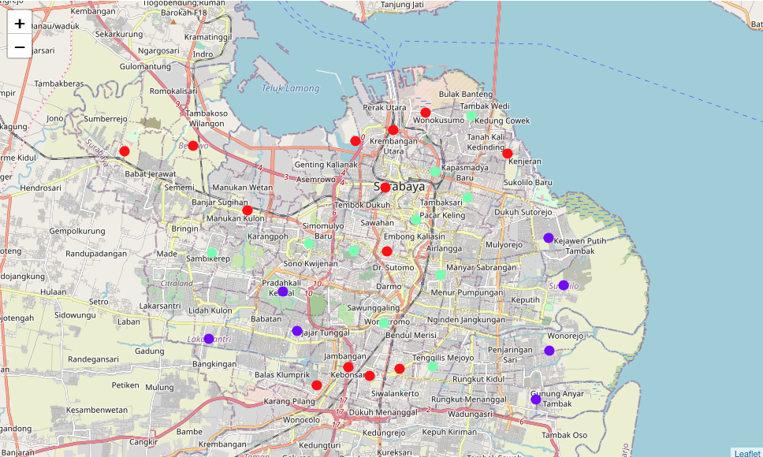
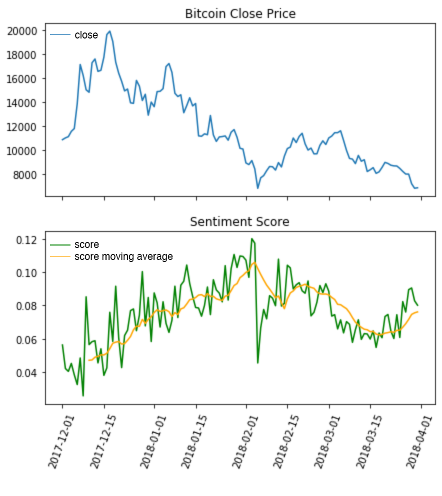

# Data Science Portfolio by Vejryn Shaviero

This repository covers my data science portfolio projects.

## K-means Clustering

### Implementing Clustering Algorithm to Open a New Coffee Shop in Surabaya

(July 2020, IBM Data Science Specialization Capstone Project)

- [Github](https://github.com/vejryn/data_science_portfolio/tree/master/Surabaya%20Coffee%20Shop%20Clustering) / [Nbviewer](https://github.com/vejryn/data_science_portfolio/blob/master/Surabaya%20Coffee%20Shop%20Clustering/Surabaya_Coffee_Shop_Clustering.ipynb)
- [Linkedin Blogpost](https://www.linkedin.com/pulse/exploring-data-open-new-coffee-shop-surabaya-vejryn-shaviero/?trackingId=KOvONtflTdGzbgakZlH%2FZQ%3D%3D)
- Applying K-means Clustering algorithm to help investor determine best location to open a new coffee shop in Surabaya.

## Natural Language Processing

### Twitter Sentiment Analysis for Bitcoin : A Face of Complacency
 <!-- .element heigh="75%" width="75%" -->

(Oct 2020, Personal)
- [Github](https://github.com/vejryn/data_science_portfolio/tree/master/Twitter%20Sentiment%20Analysis%20for%20Bitcoin) / [Nbviewer](https://nbviewer.jupyter.org/github/vejryn/data_science_portfolio/blob/master/Twitter%20Sentiment%20Analysis%20for%20Bitcoin/Twitter_Sentiment_Analysis_for_Bitcoin.ipynb)
- Implementing VADER for twitter sentiment analysis for bitcoin.

Note : If some project material such as data are missing, it's possibly because the data exceeded the file size limit or the data cannot be public. In case github render are slow or not rendering at all, it is recommended to open the notebook from nbviewer, or download the HTML version.

## Monte Carlo Simulation

### Monte Carlo Simulation for Momentum Algorithm Trades

- [Github](https://github.com/vejryn/data_science_portfolio/blob/master/Improving%20Momentum%20Trading%20Algorithm/Monte_Carlo_Simulation.ipynb) / [Nbviewer](https://nbviewer.jupyter.org/github/vejryn/data_science_portfolio/blob/master/Improving%20Momentum%20Trading%20Algorithm/Monte_Carlo_Simulation.ipynb)
- Performing Monte Carlo Simulation to gauge risk from simulated equity curve and drawdowns.
